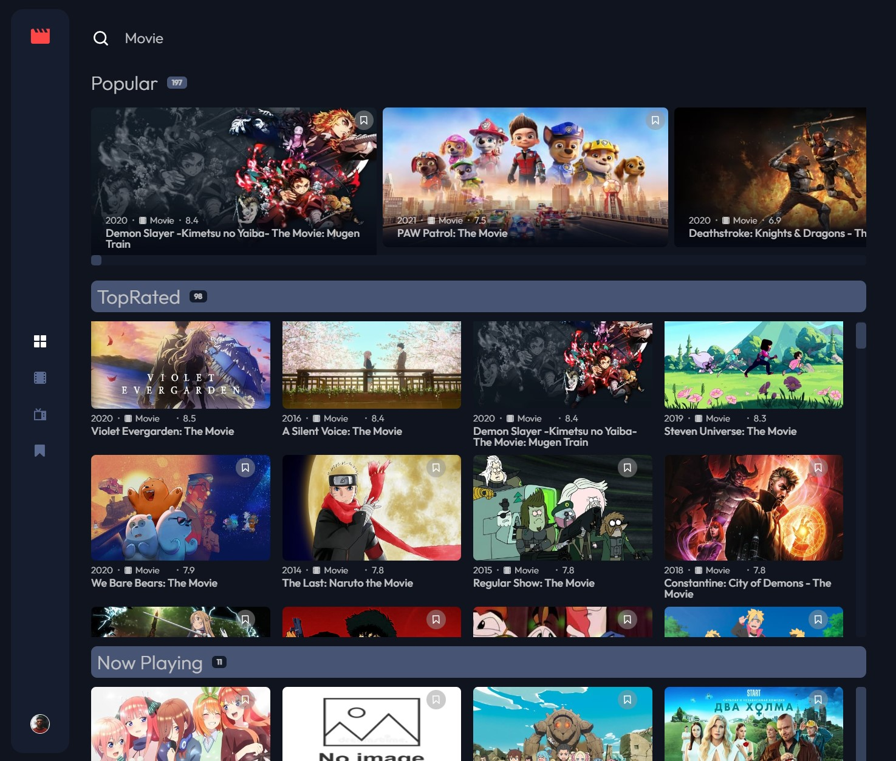

# Frontend Mentor - Entertainment web app solution

This is a solution to the [Entertainment web app challenge on Frontend Mentor](https://www.frontendmentor.io/challenges/entertainment-web-app-J-UhgAW1X). Frontend Mentor challenges help you improve your coding skills by building realistic project.

## Table of contents

- [Overview](#overview)
  - [The challenge](#the-challenge)
  - [Screenshot](#screenshot)
  - [Links](#links)
- [My process](#my-process)
  - [Built with](#built-with)
  - [What I learned](#what-i-learned)
  - [Continued development](#continued-development)
- [Author](#author)

## Overview

### The challenge

The challenge is to build out this entertainment web application and get it looking as close to the design as possible.

Users should be able to:

- View the optimal layout for the app depending on their device's screen size
- See hover states for all interactive elements on the page
- Navigate between Home, Movies, TV Series, and Bookmarked Shows pages
- Add/Remove bookmarks from all movies and TV series
- Search for relevant shows on all pages
- Use a full-stack application
- Use an auth flow

### Screenshot

### Requirements

- General
  - The navigation menu should be fixed to the left for larger screens. Use the "Desktop - Home" page in the design as a visual reference.
- Home
  - The trending section should scroll sideways to reveal other trending shows
  - Any search input should search through all shows (i.e. all movies and TV series)
- Movies
  - This page should only display shows with the "Movie" category
  - Any search input should search through all movies
- TV Series
  - This page should only display shows with the "TV Series" category
  - Any search input should search through all TV series
- Bookmarked Shows
  - This page should display all bookmarked shows from both categories
  - Any search input should search through all bookmarked shows

### Links

- Solution URL: [Add solution URL here](https://your-solution-url.com)
- Live Site URL: [Add live site URL here](https://your-live-site-url.com)

## My process

### Built with

- Semantic HTML5 markup
- CSS custom properties
- CSS Grid / Flexbox
- RWD
- [React](https://reactjs.org/) - JS library
- [React Redux] (https://react-redux.js.org) - A Predictable State Container for JS Apps
- [React Router](https://v5.reactrouter.com/) - React Router Library
- [Styled Components](https://emotion.sh/) - Styled components with emotion.sh
- [Typescript](https://www.typescriptlang.org/) - JS with syntax for types

### What I learned

- Use Typescript together with React, React Router, React Redux and Styled Components
- Auth workflow ....
- Load data from ....

### Continued development

Let's see what's coming next...

## Author

- Website - [EdMadd Profile Page](https://profilepage.edmadd.eu/)
- Frontend Mentor - [@MartinEichinger](https://www.frontendmentor.io/profile/MartinEichinger)
- LinkedIn - [@MartinEichinger](https://www.linkedin.com/in/martin-eichinger-31a53a201/)
